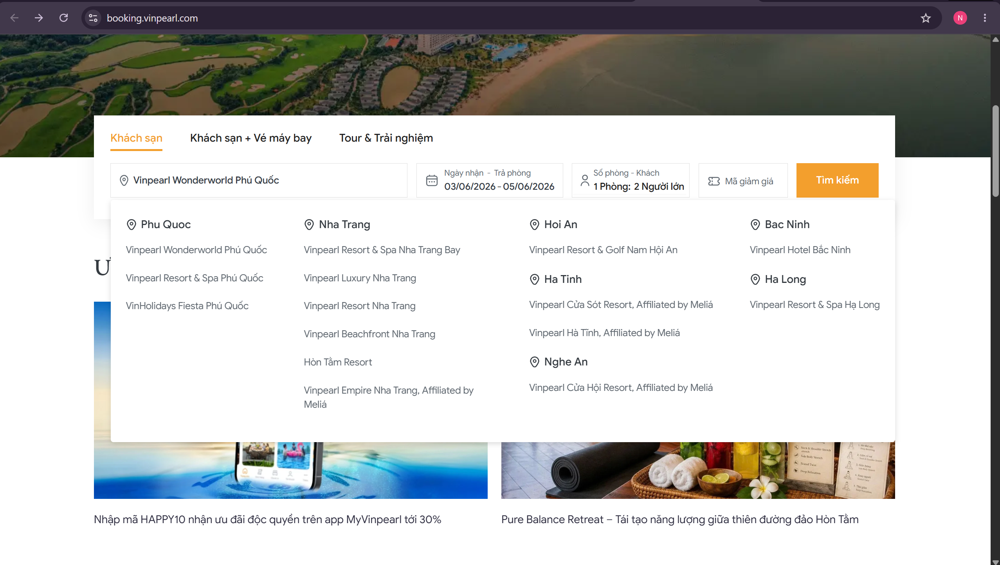
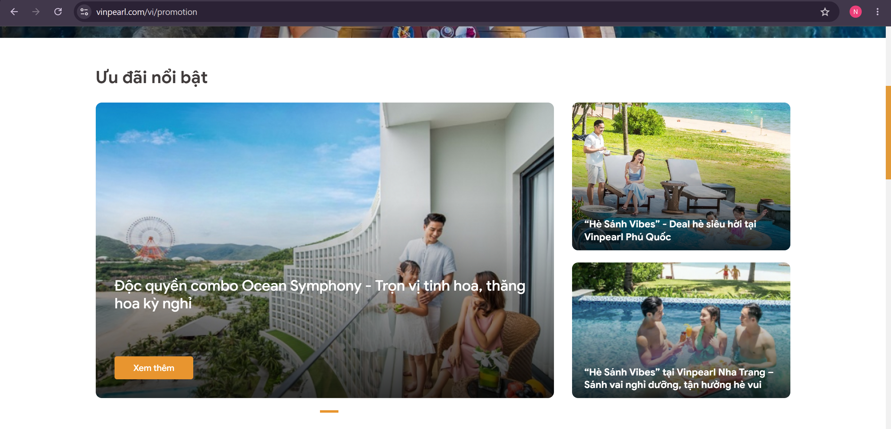
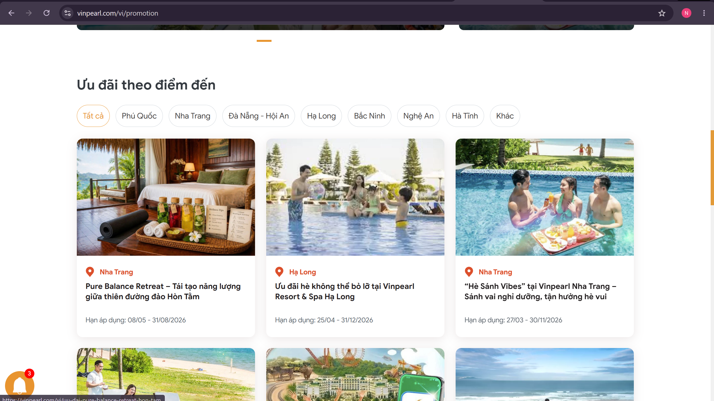
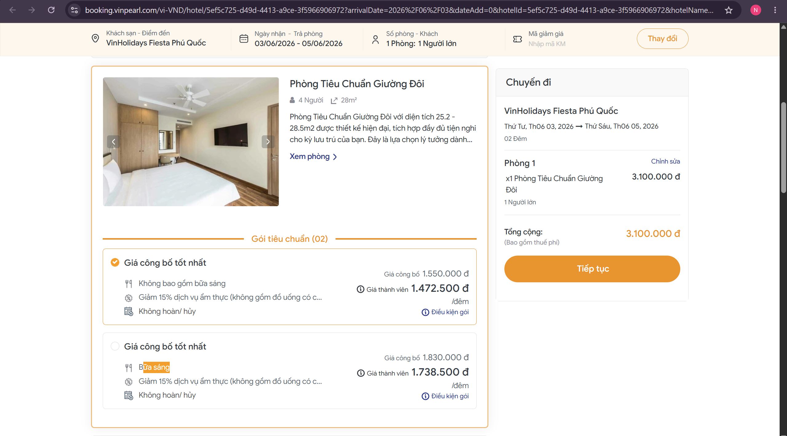
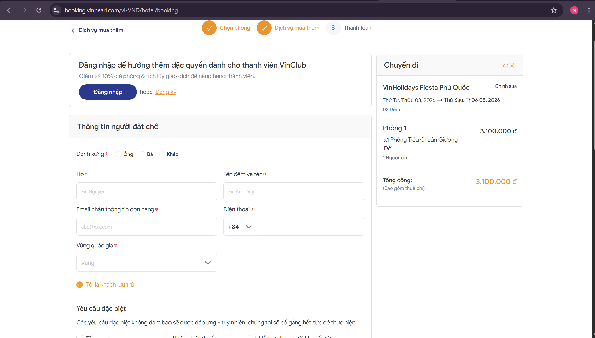

# Workshop — Mổ App AI Thật

**Học viên:** Nguyễn Trọng Khánh — MSSV: 2A202600796  
**Track:** Travel & Hospitality  
**App mổ:** MyVinpearl / Vinpearl booking experience  
**Nguồn tham khảo:** App MyVinpearl và website https://vinpearl.com / https://booking.vinpearl.com  
**Thời gian:** 35-45 phút  
**Output:** finding note + sketch `as-is / to-be`

Mục tiêu không phải chấm "UI đẹp hay xấu". Mục tiêu là dùng sản phẩm thật như một bài needfinding: tìm chỗ product gãy trong workflow thật, rồi viết finding đó thành quyết định product.

## 1. Chọn một sản phẩm để dùng thử

| Sản phẩm | AI / smart feature có thể mổ | Cách truy cập |
|---|---|---|
| **MyVinpearl** / Vinpearl booking | Tìm kiếm khách sạn, gợi ý điểm đến/gói nghỉ dưỡng, ưu đãi, quản lý lịch trình, online check-in | App MyVinpearl hoặc website `vinpearl.com`, `booking.vinpearl.com` |

Theo thông tin từ Vinpearl và Google Play, MyVinpearl là app chính thức giúp khách hàng:

- Đặt phòng khách sạn/resort, vé máy bay, tour và trải nghiệm.
- Thanh toán và quản lý đơn đặt dịch vụ.
- Check-in online trước khi đến khách sạn.
- Quản lý ưu đãi/VinClub.
- Quản lý lịch trình và nhận thông tin khuyến mãi.

AI / smart feature mổ kỹ trong buổi này:

1. **Tìm kiếm và gợi ý kỳ nghỉ / khách sạn / combo trải nghiệm** khi user chưa biết rõ nên đi đâu, ở resort nào, chọn gói nào.
2. **Luồng ưu đãi / booking package**: user thấy nhiều offer, combo, voucher nhưng cần hiểu gói nào phù hợp với nhu cầu thật.
3. **Online check-in / quản lý lịch trình**: app hứa giảm thời gian chờ và giúp chuyến đi trọn vẹn hơn, nhưng cần xem user có dễ biết việc tiếp theo cần làm không.

## 2. Dùng thử: promise vs reality

- **Product hứa gì?** MyVinpearl hứa giúp khách hàng lên kế hoạch kỳ nghỉ tại hệ sinh thái Vinpearl: đặt phòng, đặt vé máy bay, chọn tour/trải nghiệm, thanh toán, check-in online, quản lý lịch trình và săn ưu đãi trong một app.
- **User nào được hứa sẽ được giúp?** Người đang lên kế hoạch du lịch/nghỉ dưỡng, đặc biệt là người lần đầu đi Vinpearl hoặc đang phân vân giữa nhiều điểm đến/gói combo.
- **Bạn kỳ vọng AI/smart system làm task nào?**
  1. Khi mình mơ hồ kiểu "muốn đi nghỉ 2 ngày 1 đêm với gia đình", "đi Phú Quốc nên ở resort nào", "ngân sách khoảng X" thì hệ thống nên hỏi lại tiêu chí và gợi ý gói phù hợp.
  2. Khi có nhiều ưu đãi/combo, hệ thống nên giải thích rõ gói nào hợp với nhu cầu nào, bao gồm gì, điều kiện áp dụng ra sao.
  3. Trước ngày đi, app nên nhắc việc cần làm: online check-in, giấy tờ, giờ nhận phòng, dịch vụ đã đặt, hoạt động gợi ý.
- **Khi dùng thật, điểm gãy xuất hiện ở đâu?**
  - Website/app có nhiều lựa chọn: khách sạn, khách sạn + vé máy bay, tour & trải nghiệm, ưu đãi, VinClub. Với user chưa rõ nhu cầu, hệ thống chủ yếu yêu cầu nhập điểm đến/ngày/phòng/khách, nhưng **không có flow hỏi lại mục đích chuyến đi, ngân sách, nhóm đi cùng, sở thích** để gợi ý gói phù hợp.
  - Các ưu đãi/package có nhiều điều kiện và quyền lợi. User dễ bị overload vì phải tự đọc nhiều offer để hiểu gói nào đáng chọn.
  - Review Google Play có phản ánh lỗi booking/ưu đãi: "website and app are super glitchy", nhiều pop-up, deal không khả dụng, click vào deal bị blank screen hoặc loop pop-up. Đây là failure/recovery path đáng chú ý.

**Evidence cần có (bổ sung từ lần dùng thật của bạn):**

- Screenshot 1: màn hình search/booking trên `vinpearl.com` hoặc app MyVinpearl khi chọn điểm đến/ngày/phòng/khách.

- Screenshot 2: màn hình ưu đãi/combo/package, ví dụ deal app MyVinpearl, khách sạn + vé máy bay, tour & trải nghiệm.


- Screenshot 3: nếu có thể, thử một luồng booking hoặc check-in online đến bước không cần thanh toán, ghi lại điểm nào gây phân vân.

Khó nhận ra điểm khác biệt dẫn đến chênh lệch giá tiền
- Prompt/input đã thử hoặc scenario đã dùng, ví dụ: "gia đình 4 người đi Phú Quốc 3 ngày 2 đêm", "couple nghỉ dưỡng Nha Trang cuối tuần", "muốn đi VinWonders + khách sạn".

- Quote/review ngoài nhóm từ Google Play/App Store/Facebook/Tripadvisor/Booking.com về đặt phòng, ưu đãi, app lỗi, check-in, hoặc khó chọn gói.

Nguồn ngoài nhóm đã tìm được để tham khảo ban đầu:
```text
Google Play — MyVinpearl review highlight:
"your website and app are super glitchy. way too many pop-ups. it's very difficult to book a room. the deals that pop up are not available. when you click on them it takes you to a blank screen or put you in a loop where you get another pop-up for the same deal..."
```

Review này gợi ý pain liên quan đến booking difficulty, unavailable deals, blank screen, pop-up loop. Cần chụp/ghi nguồn trực tiếp khi nộp nếu dùng làm evidence chính.

## 3. Vẽ 4 paths

| Path | Quan sát trên MyVinpearl / Vinpearl |
|---|---|
| **Happy** | User đã biết rõ điểm đến/ngày đi, ví dụ "Phú Quốc, 3 ngày 2 đêm, 2 người lớn" → nhập vào booking form → thấy danh sách khách sạn/phòng/gói → có thể tiếp tục đặt. |
| **Low-confidence** | User chỉ có nhu cầu mơ hồ như "muốn đi nghỉ dưỡng với gia đình", "ngân sách vừa phải", "muốn có VinWonders/Safari" → hệ thống không hỏi lại mục đích chuyến đi, ngân sách, độ tuổi trẻ em, sở thích; user phải tự đọc nhiều khách sạn/ưu đãi/combo. Đây là điểm gãy chính. |
| **Failure** | User click vào ưu đãi/deal nhưng deal không khả dụng, màn hình trắng, pop-up lặp lại, hoặc không hiểu điều kiện áp dụng → user không biết nên quay lại bước nào hay chọn gói thay thế nào. Review Google Play có phản ánh dạng lỗi này. |
| **Correction** | User đổi tiêu chí như thêm trẻ em, muốn gần VinWonders, cần airport transfer, muốn budget thấp hơn → hệ thống chưa thể hiện rõ việc học/cập nhật preference để giải thích lại vì sao gói mới phù hợp hơn. |

## 4. Viết finding thành quyết định

```text
Khi user lần đầu lên kế hoạch nghỉ dưỡng Vinpearl nhưng chưa biết nên chọn điểm đến/resort/combo nào,
MyVinpearl/Vinpearl đưa nhiều lựa chọn booking và ưu đãi nhưng chủ yếu yêu cầu user tự nhập thông tin cứng như điểm đến, ngày, số phòng, số khách,
thay vì hỏi 2-3 tiêu chí ra quyết định như mục đích chuyến đi, nhóm đi cùng, ngân sách, hoạt động mong muốn.
Hậu quả là user phải tự đọc nhiều gói, dễ bị overload, chọn sai gói hoặc bỏ dở booking.
Lỗi thuộc layer Intent + Decision Support + UX Recovery.
Nên sửa bằng low-confidence path: AI hỏi nhanh 3-4 câu về nhóm đi, ngân sách, sở thích và ràng buộc,
rồi gợi ý 2-3 gói nghỉ dưỡng phù hợp kèm lý do, quyền lợi chính và điều kiện cần lưu ý.
```

(Finding phụ — cho path Failure)

```text
Khi user click vào ưu đãi/deal nhưng deal không khả dụng hoặc bị loop/blank screen,
hệ thống không giúp user hiểu nguyên nhân và không đề xuất phương án thay thế tương đương,
hậu quả là user mất niềm tin và có thể bỏ dở đặt phòng.
Lỗi thuộc layer UX Recovery + Data/Availability.
Nên sửa bằng: phát hiện deal không khả dụng -> giải thích ngắn lý do -> gợi ý 2 deal/phòng thay thế cùng ngân sách hoặc quyền lợi gần nhất.
```

## 5. Sketch as-is / to-be

```text
AS-IS (hiện tại)                                  TO-BE (đề xuất)
────────────────────────────────────             ────────────────────────────────────
User muốn đi nghỉ Vinpearl                         User muốn đi nghỉ Vinpearl
nhưng chưa biết chọn gói nào                       nhưng chưa biết chọn gói nào
   │                                                   │
   │                                                   ▼
Vào app/web booking                                AI hỏi 3-4 câu nhanh:
   │                                               - Đi với ai? couple / gia đình / bạn bè
   ▼                                               - Ngân sách khoảng bao nhiêu?
Nhập điểm đến/ngày/phòng/khách                    - Muốn nghỉ dưỡng, vui chơi, hay cả hai?
   │                                               - Có trẻ em/người lớn tuổi không?
   ▼                                                   │
Danh sách nhiều khách sạn/gói/ưu đãi                  ▼
   │  ◀── ĐIỂM GÃY                                AI gợi ý 2-3 package:
User tự đọc nhiều điều kiện                        - Gói A: phù hợp gia đình + gần VinWonders
và tự so sánh                                      - Gói B: tiết kiệm hơn + có breakfast
   │                                               - Gói C: nghỉ dưỡng cao cấp + spa/transfer
   ▼                                                   │
Decision fatigue / bỏ dở booking                      ▼
                                                   User chọn / sửa tiêu chí
                                                   "rẻ hơn", "có Safari", "ít di chuyển"
                                                       │
                                                       ▼
                                                   AI cập nhật gợi ý + giải thích thay đổi
```

## 6. Tự kiểm trước khi nộp

- [x] Có ít nhất 1 screenshot hoặc observation cụ thể. → *cần dán screenshot thật từ app/web MyVinpearl hoặc Vinpearl booking.*
- [x] Có đủ 4 paths hoặc nói rõ path nào chưa có trong product.
- [x] Finding được viết thành product decision, không chỉ là nhận xét.
- [x] Sketch có as-is và to-be.
- [x] Có một câu nói rõ finding này sẽ đổi gì trong SPEC.

